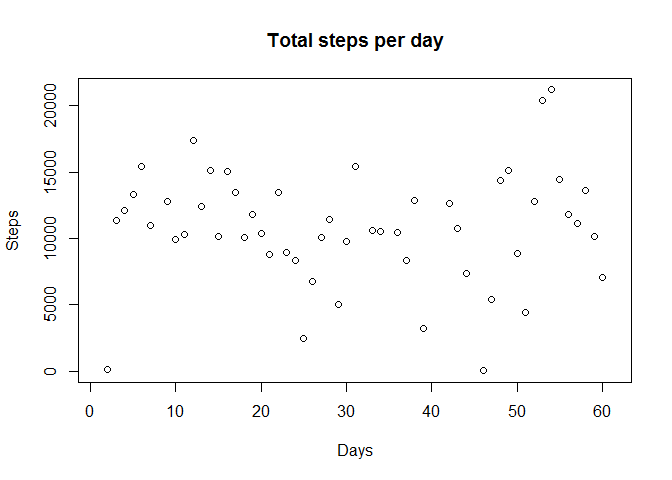
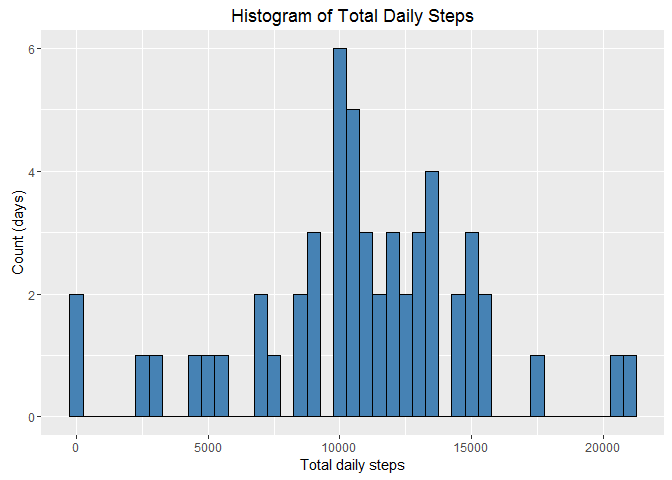

# Reproducible Research: Peer Assessment 1

First of all, we're going to load the R-package `ggplot2` for creating nice-looking plots: 

```r
require(ggplot2)
```

```
## Loading required package: ggplot2
```


## Loading and preprocessing the data
The data is available in the 'activity.zip' file. We're going to read it in directly from the zipped archive:

```r
        data <- read.csv(unz("activity.zip","activity.csv"))
```

Let's see the data formats, using `str`:

```r
        str(data)
```

```
## 'data.frame':	17568 obs. of  3 variables:
##  $ steps   : int  NA NA NA NA NA NA NA NA NA NA ...
##  $ date    : Factor w/ 61 levels "2012-10-01","2012-10-02",..: 1 1 1 1 1 1 1 1 1 1 ...
##  $ interval: int  0 5 10 15 20 25 30 35 40 45 ...
```

Since the date column is stored as a factor, let's create column 'date2' in the `POSIXlt` format for later use:

```r
        data$date2 <- strptime(data$date, "%Y-%m-%d")
        str(data)
```

```
## 'data.frame':	17568 obs. of  4 variables:
##  $ steps   : int  NA NA NA NA NA NA NA NA NA NA ...
##  $ date    : Factor w/ 61 levels "2012-10-01","2012-10-02",..: 1 1 1 1 1 1 1 1 1 1 ...
##  $ interval: int  0 5 10 15 20 25 30 35 40 45 ...
##  $ date2   : POSIXlt, format: "2012-10-01" "2012-10-01" ...
```

## What is mean total number of steps taken per day?

First, we'll calculate the total number of steps taken per day and print the result in a scatterplot:

```r
        dailysum <- tapply(data$steps, data$date, FUN=sum)
        plot(dailysum, main ="Total steps per day", xlab="Days", ylab="Steps")
```

<!-- -->

Then we're going to make a simple histogram plot:

```r
         ggplot() + aes(dailysum)+ geom_histogram(binwidth=500, colour="black", fill="steelblue", na.rm=TRUE) + ggtitle("Histogram of Total Daily Steps") + xlab("Total daily steps") + ylab("Count (days)")
```

<!-- -->

The  mean and median of the total number of steps taken per day are:

```r
        mean <- as.integer(mean(dailysum, na.rm=TRUE))
        median <- as.integer(median(dailysum, na.rm=TRUE))
```
- Median: 10765
- Mean: 10766

_Note the `as.integer`, which I used to prevent double precision that will provide no valuable information._

## What is the average daily activity pattern?


## Imputing missing values


## Are there differences in activity patterns between weekdays and weekends?
