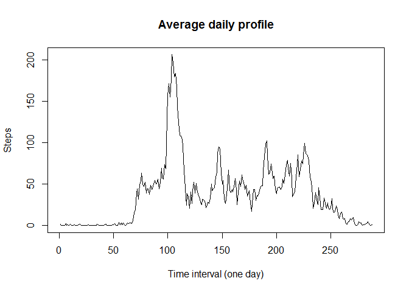
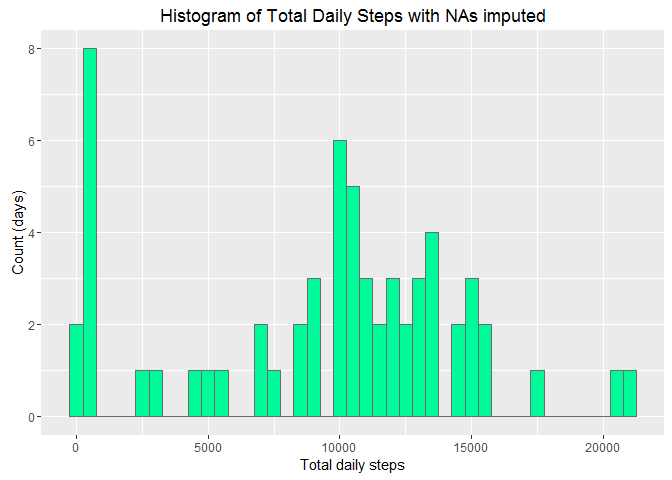
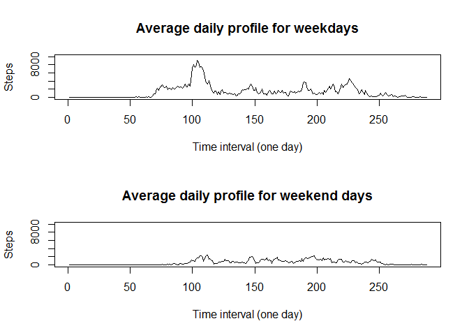

# Reproducible Research: Peer Assessment 1

First of all, we're going to load the R-package `ggplot2` for creating nice-looking plots and `dplyr` for manipulating the data: 

```r
require(ggplot2)
```

```
## Loading required package: ggplot2
```

```r
require(dplyr)
```

```
## Loading required package: dplyr
```

```
## 
## Attaching package: 'dplyr'
```

```
## The following objects are masked from 'package:stats':
## 
##     filter, lag
```

```
## The following objects are masked from 'package:base':
## 
##     intersect, setdiff, setequal, union
```


## Loading and preprocessing the data
### 1. Loading the data
The data is available in the 'activity.zip' file. We're going to read it in directly from the zipped archive:

```r
        data <- read.csv(unz("activity.zip","activity.csv"))
```

Let's see the data formats, using `str`:

```r
        str(data)
```

```
## 'data.frame':	17568 obs. of  3 variables:
##  $ steps   : int  NA NA NA NA NA NA NA NA NA NA ...
##  $ date    : Factor w/ 61 levels "2012-10-01","2012-10-02",..: 1 1 1 1 1 1 1 1 1 1 ...
##  $ interval: int  0 5 10 15 20 25 30 35 40 45 ...
```

### 2. Preprocessing the data (optional)
Since the date column is stored as a factor, let's create column 'date2' in the `POSIXct` format for later use. And we'll create a new column 'time' that contains the interval time in a 4-digit format.

```r
        data$date2 <- as.POSIXct(data$date)
        data$time <- formatC(data$interval, width=4, format="d", flag="0")
        str(data)
```

```
## 'data.frame':	17568 obs. of  5 variables:
##  $ steps   : int  NA NA NA NA NA NA NA NA NA NA ...
##  $ date    : Factor w/ 61 levels "2012-10-01","2012-10-02",..: 1 1 1 1 1 1 1 1 1 1 ...
##  $ interval: int  0 5 10 15 20 25 30 35 40 45 ...
##  $ date2   : POSIXct, format: "2012-10-01" "2012-10-01" ...
##  $ time    : chr  "0000" "0005" "0010" "0015" ...
```

## What is mean total number of steps taken per day?

### 1. Total total number of steps per day
First, we'll calculate the total number of steps taken per day and print the result in a scatterplot:

```r
        dailysum <- tapply(data$steps, data$date, FUN=sum)
        plot(dailysum, main ="Total steps per day", xlab="Days", ylab="Steps")
```

<!-- -->

```r
        max <- max(dailysum, na.rm=TRUE)
```

For example, the above plot shows that the maximum total number of steps per day is 21194 steps.

### 2. Histogram of the total number of steps per day
Then we're going to make a simple histogram plot:

```r
         ggplot() + aes(dailysum)+ geom_histogram(binwidth=500, colour="black", fill="steelblue", na.rm=TRUE) + ggtitle("Histogram of Total Daily Steps") + xlab("Total daily steps") + ylab("Count (days)")
```

<!-- -->

### 3. Mean and median total number of steps per day
The  mean and median of the total number of steps taken per day are:

```r
        mean <- as.integer(mean(dailysum, na.rm=TRUE))
        median <- as.integer(median(dailysum, na.rm=TRUE))
```
- Median: 10765
- Mean: 10766

_Note the `as.integer`, which I used to prevent double precision that would provide no valuable information._

## What is the average daily activity pattern?
### 1. Time-series plot of average daily pattern
Create the daily activity pattern by calculating the average number of steps per 5-minute interval:

```r
        profile <- tapply(data$steps, data$time, FUN=mean, na.rm=TRUE)
```

Plot the data on a simple line graph:

```r
        plot(profile, type = "l", xlab="Time interval (one day)", ylab="Steps", main="Average daily profile")
```

<!-- -->

### 2. The 5-minute time-interval with the maximum number of steps
The interval in which the most steps are taken (on average over the dataset) is calculated as follows:

```r
        max <- as.integer(max(profile))
        maxinterval <- match(max(profile), profile)
```

From the daily profile, the maximum number of steps in any interval is 206 and occurs on time interval 104.


## Imputing missing values

### 1. Total number of rows containing missing values

```r
        missing <- sum(!complete.cases(data[,c(1:3)]))
```

The dataset contains 2304 observations (rows) with missing values (NA).

### 2. Strategy to fill in the missing values
We'll assume that the missing values are caused by a data communication or other technical failure. Then, we can make the simplified assumption that the persons with missing data behaved like the 'average' person from the rest of the dataset. Now, we can calculate the mean for every 5-minute interval, excluding the NA's and subset the NA's with that outcome. See the next step for execution of this strategy.


### 3. Create new dataset with missing data filled in

We'll create a second data.frame named 'data_imp' where we're going to fill in the profile values where missing values are found. To be able to map the profile data to the missing values in the new data.frame, we'll create a second dataframe that contains the same 'time' values as created in the preprocessing step (column `data$time`).


```r
        data_imp <- data
        times <- data$time[1:288]
        ## create a data.frame for the profile
        profile <- data.frame(profile, times)
        names(profile) <- c("mean", "time")

        ## impute missing values with a for-loop
        i <- 1
        for (i in 1:17568) {
                
                if (is.na(data_imp$steps[i])) {
                        time <- data_imp$time[i]
                        data_imp$imputed[i] <- profile$mean[profile$time=="0000"]
                        } else {
                        data_imp$imputed[i] <- data_imp$steps[i]
                        }
                }
        i=i+1
         
        ## check if there really are no more NA's in the new 'imputed'column
        nas <- sum(is.na(data_imp$imputed))
```
Number of missing values after imputing the NA's: 0. _this (should be 0!)_


### 4. Make a histogram and report mean and median steps per day

Create a histogram plot of the new data, exactly the way we made in the first part of the assignment but using the new dataframe with NA-imputed data:

```r
        str(data_imp)        
```

```
## 'data.frame':	17568 obs. of  6 variables:
##  $ steps   : int  NA NA NA NA NA NA NA NA NA NA ...
##  $ date    : Factor w/ 61 levels "2012-10-01","2012-10-02",..: 1 1 1 1 1 1 1 1 1 1 ...
##  $ interval: int  0 5 10 15 20 25 30 35 40 45 ...
##  $ date2   : POSIXct, format: "2012-10-01" "2012-10-01" ...
##  $ time    : chr  "0000" "0005" "0010" "0015" ...
##  $ imputed : num  1.72 1.72 1.72 1.72 1.72 ...
```

```r
        dailysum_imp <- tapply(data_imp$imputed, data_imp$date, FUN=sum)
        
        ggplot() + aes(dailysum_imp)+ geom_histogram(binwidth=500, fill="mediumspringgreen", color="grey42") + ggtitle("Histogram of Total Daily Steps with NAs imputed") + xlab("Total daily steps") + ylab("Count (days)")
```

<!-- -->

The mean and median steps per day are calculated here:

```r
        mean <- as.integer(mean(dailysum_imp))
        median <- as.integer(median(dailysum_imp))
```
- Median: 10395
- Mean: 9419


Difference with original data: since we used the 'mean' function to create the profile data to fill up the missing values, the mean is somewhat 'stronger' in our new dataset. But overall, when we look at the histograms the difference is quite small. Thus the impact of this type of imputing is small.


## Are there differences in activity patterns between weekdays and weekends?

### 1. Create factor variable weekday/weekend

Use the 'weekdays' function to create a column that contains the (abbreviated) name of the weekday. Then, create a vector that contains "weekend" or "weekday".


```r
        data_imp$weekday <- as.factor(weekdays(data_imp$date2, abbreviate = TRUE))
        
        daytype <- function(weekday) {
                if (weekday %in% c("za", "zo")) {
                "weekend"
                } else {
                "weekday"
                }
        }
        
        data_imp$daytype <- as.factor(sapply(data_imp$weekday, daytype))
```

### 2. Make a panel plot for weekdays and weekend days

This is a very basic panel plot. I've used the base plotting system here to save some time.

```r
        weekday_subset <- filter(data_imp, daytype == "weekday")
        weekend_subset <- filter(data_imp, daytype == "weekend")

        profile_weekday <- tapply(weekday_subset$imputed, weekday_subset$time, FUN=sum)
        profile_weekend <- tapply(weekend_subset$imputed, weekend_subset$time, FUN=sum)
        
        par(mfrow=c(2,1))
        
        plot(profile_weekday, type = "l", xlab="Time interval (one day)", ylab="Steps", main="Average daily profile for weekdays", ylim=c(0,10000))
         plot(profile_weekend, type = "l", xlab="Time interval (one day)", ylab="Steps", main="Average daily profile for weekend days", ylim=c(0,10000))
```

<!-- -->


#END
